# ParadoxOS Architecture

## System Overview

ParadoxOS is a **physics-native operating system** where computation emerges from physical laws rather than traditional scheduling and execution models.


---

## Core Components

### 1. Kernel - The Physics Engine

**Purpose:** Global state evolution and law enforcement

**NOT a traditional kernel:**
- ❌ No scheduler
- ❌ No interrupt handlers  
- ❌ No system calls
- ✅ Physics law enforcer
- ✅ Energy distributor
- ✅ Entropy tracker

**Key Properties:**
```rust
struct Kernel {
    global_energy: f64,      // Total system energy (conserved)
    global_entropy: f64,     // Total entropy (monotonic increase)
    law_set: &'static [Law], // Immutable physics laws
    universes: HashMap<UniverseID, Universe>,
    interactions: HashMap<InteractionID, Interaction>,
}
```

---

### 2. Universe - The Execution Unit

**Replaces:** Process, Thread, Container, VM

**Properties:**
```rust
struct Universe {
    id: UniverseID,
    state_vector: StateVector,     // Opaque computational state
    energy: f64,                    // Available computational energy
    entropy: f64,                   // Disorder/complexity measure
    stability_score: f64,           // 0.0 (unstable) to 1.0 (stable)
    timeline_index: i64,            // Local time counter
    interaction_links: Set<InteractionID>,
}
```

**Lifecycle:**
1. **Spawn** - Created with initial energy allocation
2. **Evolve** - State changes when interaction pressure > resistance
3. **Interact** - Exchanges energy with other universes
4. **Collapse** - Terminates when stability falls below threshold

**Isolation:**
- Cannot directly access other universes
- Cannot mutate without entropy increase
- Cannot gain energy without interaction

---

### 3. Interaction - The Causal Channel

**Purpose:** The ONLY way universes influence each other

**Properties:**
```rust
struct Interaction {
    id: InteractionID,
    source: UniverseID,
    target: UniverseID,
    coupling_strength: f64,  // How strongly coupled (0.0 to 1.0)
    momentum: f64,           // Energy transfer rate
    decay_rate: f64,         // Natural weakening over time
}
```

**Types of Interactions:**
- **Message Passing** - Data exchange
- **Energy Transfer** - Computational resource sharing
- **State Synchronization** - Distributed consistency
- **Collapse Trigger** - Instability propagation

---

## Physics Laws Architecture

### Law Enforcement Pipeline

```mermaid
flowchart LR
    subgraph "Every Evolution Step"
        A[1. Observe<br/>Interactions] --> B[2. Compute<br/>Entropy Gradients]
        B --> C[3. Redistribute<br/>Energy]
        C --> D[4. Evolve<br/>Universes]
        D --> E[5. Collapse<br/>Unstable]
    end
    
    subgraph "Conservation Checks"
        C -.verify.-> F[Energy<br/>Conservation]
        B -.verify.-> G[Entropy<br/>Monotonicity]
    end
    
    subgraph "Evolution Condition"
        D -.check.-> H[ΣF_ext / ΣR_int<br/>> threshold?]
    end
    
    style F fill:#1a3d1a,stroke:#44ff44,stroke-width:2px
    style G fill:#3d1a1a,stroke:#ff4444,stroke-width:2px
    style H fill:#1a1a3d,stroke:#4444ff,stroke-width:2px
```



### The 13 Fundamental Laws (Summary)

| Law | Name | Constraint | Impact |
|-----|------|------------|--------|
| 0 | Existence | All entities have state | No null processes |
| 1 | Energy Conservation | Σ E = constant | CPU time is finite |
| 2 | Entropy Monotonicity | ΔS ≥ 0 | No perfect reversibility |
| 3 | Interaction Primacy | No effect without interaction | No hidden channels |
| 4 | Force-Resistance Velocity | Ve = ΣF/ΣR | Speed is emergent |
| 5 | ΔS(Δc) Emergence | Local acceleration | Congestion slowdown |
| 6 | Hamiltonian Evolution | State follows energy | No instruction stepping |
| 7 | Temporal Relativity | Time is local | Busy → slow time |
| 8 | Memory as Potential | Compression is ground state | RAM is a phase |
| 9 | Stability & Collapse | Unstable → collapse | No zombie processes |
| 10 | Security as Physics | Hidden energy = anomaly | Malware detection |
| 11 | Observer Effect | Observation constrains futures | Debugging matters |
| 12 | Language Neutrality | Languages → graphs | Universal support |
| 13 | Forbidden Concepts | No threads/schedulers | Paradigm enforcement |

---

## Time Architecture (Chronos)

### No Global Clock

Each universe experiences **local time**:

```
Δt_universe ∝ 1 / interaction_density
```

**Implications:**
- **High activity** → Time dilation (feels slow)
- **Low activity** → Time acceleration (fast-forward)
- **Sleep** → Near-zero interaction (frozen time)


---

## Memory Architecture

### Memory as Potential Energy


**Key Concepts:**
- **Latent Form** - Compressed, low-energy storage (disk/cold RAM)
- **Excited Form** - Expanded, high-energy access (hot RAM/cache)
- **Automatic Phase Transition** - Idle data auto-compresses

**ParadoxLF Integration:**
- All state vectors stored in ParadoxLF format
- Transparent compression/decompression
- Entropy tracking per memory object

---

## Execution Model

### Traditional OS vs ParadoxOS


### Evolution vs Execution

**Traditional:**
```
while (true) {
    process = scheduler.next();
    execute(process, time_slice);
}
```

**ParadoxOS:**
```rust
loop {
    for universe in universes {
        let pressure = calc_interaction_pressure(universe);
        let resistance = universe.entropy * instability;
        
        if pressure > resistance {
            // Evolution happens naturally
            universe.evolve();
        }
    }
}
```

---

## Security Architecture

### Physics-Based Security

```mermaid
flowchart TD
    A[Potential Attack] --> B{Energy<br/>Accounted?}
    B -->|No| C[🚨 Anomaly Detected]
    B -->|Yes| D{Entropy<br/>Gradient OK?}
    D -->|No| C
    D -->|Yes| E{Interaction<br/>Authorized?}
    E -->|No| C
    E -->|Yes| F[✅ Allowed]
    
    C --> G[Universe Collapse]
    
    style C fill:#ff0000,color:#fff
    style F fill:#00ff00,color:#000
```



**No Traditional Security:**
- ❌ No permissions
- ❌ No ACLs
- ❌ No firewalls

**Physics Enforcement:**
- ✅ Conservation violations → Detection
- ✅ Entropy anomalies → Malware identification
- ✅ Dimensional isolation → No cross-universe attacks

**Security Invariants:**
```
Invariant 1: Δenergy_detected = Δenergy_accounted
Invariant 2: No cross-universe mutation
Invariant 3: No hidden energy injection
```

---

## Paradox AGI Integration

### AGI as Kernel Resident


**Observer Roles:**
1. **Entropy Reduction** - Find low-entropy paths
2. **Instability Prediction** - Forecast universe collapses
3. **Topology Optimization** - Suggest optimal interactions
4. **Collapse Guidance** - Direct failure recovery

**Intelligence as Physics:**
- Low-entropy optimizer
- Energy-constrained
- Subject to same laws (with observation privilege)

---

## Hardware Abstraction

### Hardware as Energy Fields


**Device Abstractions:**
- **CPU** - Serial kinetic computation
- **GPU** - Parallel high-density interactions
- **FPGA** - Mutable constraint fabric
- **Network** - Long-distance entanglement
- **Storage** - Deep potential well

---

## Networking Architecture

### Wormholes vs Sockets

**Traditional:**
```
socket.connect(ip, port)
socket.send(data)
```

**ParadoxOS:**
```rust
// Cross-machine entanglement
let wormhole = kernel.entangle_remote(
    local_universe,
    remote_universe,
    latency_as_spacetime_distance
);

// State synchronization event
wormhole.sync_state(
    consistency_model: Causal
);
```

**Benefits:**
- Deterministic causal updates
- Natural distributed consensus
- Wave superposition for conflict resolution

---

## Boot Process (Big Bang)


---

## System Comparison

| Aspect | Linux/Windows/macOS | ParadoxOS |
|--------|---------------------|-----------|
| **Process Model** | Threads + Processes | Universes |
| **Scheduling** | Round-robin / CFS | Emergent (force/resistance) |
| **Time** | Global clock | Local relative time |
| **Memory** | Paged RAM | Potential energy fields |
| **IPC** | Pipes/sockets/shared mem | Interactions only |
| **Security** | Permissions + ACLs | Physics conservation |
| **Language Support** | Per-language runtime | Universal (compile to graphs) |
| **AI Integration** | External service | Kernel-resident observer |
| **Debugging** | Breakpoints | Time reversal |

---

## Design Principles

### 1. Physics First
Every feature must map to physical laws. If it doesn't fit the physics model, it doesn't belong.

### 2. Emergence Over Control
Don't force behavior, create conditions for it to emerge.

### 3. Conservation is Sacred
Energy and entropy tracking are non-negotiable.

### 4. No Classical Abstractions
Threads, schedulers, permissions are **forbidden**.

### 5. Intelligence is Native
AGI is not a service, it's a fundamental system component.

---

## Performance Characteristics

### Emergent Performance

Performance is **not tuned**, it **emerges** from:
- Interaction density
- Energy distribution
- Entropy gradients
- Stability scores

```rust
// Performance "tuning" means adjusting physics
let performance = interaction_pressure / internal_resistance;

// Not:
set_priority(HIGH);  // ❌ Forbidden!
```

### Expected Behavior

- **High interaction density** → Natural slowdown (congestion)
- **Low interaction density** → Natural speedup (parallelism)
- **Energy abundance** → More evolution opportunities
- **Energy scarcity** → Selective evolution

---

## Future Directions

### Quantum Hardware Integration
ParadoxOS naturally maps to quantum computers:
- Universes → Quantum states
- Interactions → Entanglement
- Collapse → Measurement

### Photonic Computing
Light-based processors as ultra-fast interaction fields.

### Biological Computing
DNA/molecular systems as extremely dense universes.

---

## Validation Criteria

A correct ParadoxOS implementation:
- ✅ Feels like a physics simulation
- ✅ Never violates the 13 laws
- ✅ Has emergent, not prescribed, performance
- ✅ Enforces security through conservation
- ✅ Rejects all classical OS patterns
- ✅ AGI is kernel-native, not external

---

**Status:** Architecture Documentation v1.0  
**Last Updated:** 2026-01-27  
**See Also:** `TODO.md`, `IMPLEMENTATION.md`, `paradox_os_full_package.md`
