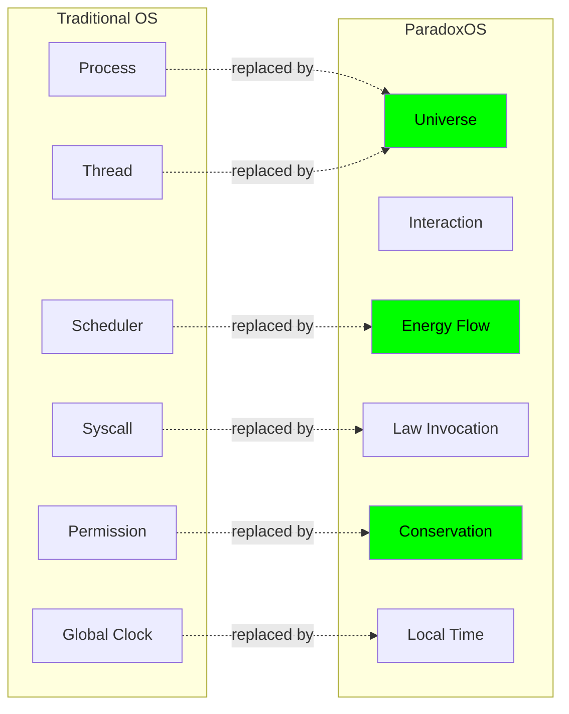

# ParadoxOS Documentation

## 🌌 Welcome to ParadoxOS

**ParadoxOS** is a revolutionary physics-native operating system where computation emerges from universal laws rather than traditional scheduling and execution models.

Unlike classical operating systems, ParadoxOS treats:
- **Processes** as **Universes** (self-contained spacetimes)
- **CPU scheduling** as **energy redistribution**
- **Memory** as **potential energy fields**  
- **Time** as **local and relative** (not global)
- **Security** as **physics conservation laws**

---

## 📚 Documentation Index

### Getting Started
- **[GETTING_STARTED.md](GETTING_STARTED.md)** - Begin here! Quick start guide, core concepts, and your first program
- **[IMPLEMENTATION.md](IMPLEMENTATION.md)** - Step-by-step implementation guide with working Rust code
- **[TODO.md](TODO.md)** - Complete 16-phase implementation roadmap

### Architecture & Design
- **[paradox_os_full_package.md](paradox_os_full_package.md)** - ⭐ **Canonical specification** - Single source of truth
- **[ARCHITECTURE.md](ARCHITECTURE.md)** - System architecture with detailed diagrams
- **[paradox_kernel_laws.md](paradox_kernel_laws.md)** - The 13 fundamental laws (non-negotiable)
- **[paradox_os_execution_model.md](paradox_os_execution_model.md)** - Mechanical execution specification
- **[paradox_os_a_physics_native_operating_system_paradigm.md](paradox_os_a_physics_native_operating_system_paradigm.md)** - Paradigm overview and vision

### API Reference
- **[KERNEL_API.md](KERNEL_API.md)** - Complete kernel API reference with examples
- **[EXAMPLES.md](EXAMPLES.md)** - 10 complete, runnable code examples

---

## 🚀 Quick Start (5 Minutes)

### 1. Install Rust
```bash
curl --proto '=https' --tlsv1.2 -sSf https://sh.rustup.rs | sh
```

### 2. Create Project
```bash
cargo init --name my_paradox_os
cd my_paradox_os
```

### 3. Follow the Guide
Open [IMPLEMENTATION.md](IMPLEMENTATION.md) and copy the code for:
- Core types (`kernel/types.rs`)
- Physics engine (`kernel/core.rs`)
- Main test (`src/main.rs`)

### 4. Run Your First Universe
```bash
cargo run
```

You'll see universes spawning, interacting, and evolving under physics laws!

---

## 🎯 Documentation Paths

### For Researchers & Theorists
1. Read [paradox_os_full_package.md](paradox_os_full_package.md) - Understand the complete theory
2. Study [paradox_kernel_laws.md](paradox_kernel_laws.md) - Learn the 13 laws
3. Review [ARCHITECTURE.md](ARCHITECTURE.md) - See how it all fits together

### For Implementers & Developers
1. Start with [GETTING_STARTED.md](GETTING_STARTED.md) - Learn core concepts
2. Follow [IMPLEMENTATION.md](IMPLEMENTATION.md) - Build the kernel step-by-step
3. Reference [KERNEL_API.md](KERNEL_API.md) - API documentation
4. Study [EXAMPLES.md](EXAMPLES.md) - See practical code

### For Project Managers
1. Check [TODO.md](TODO.md) - 16-phase implementation plan
2. Review [ARCHITECTURE.md](ARCHITECTURE.md) - System overview
3. Read [paradox_os_a_physics_native_operating_system_paradigm.md](paradox_os_a_physics_native_operating_system_paradigm.md) - Vision and goals

---

## 📖 Core Concepts

### The 13 Fundamental Laws

ParadoxOS is governed by **13 immutable physics laws** that replace traditional OS concepts:

| # | Law | What It Replaces |
|---|-----|-----------------|
| 0 | **Existence** | Process lifecycle |
| 1 | **Energy Conservation** | CPU budget |
| 2 | **Entropy Monotonicity** | State management |
| 3 | **Interaction Primacy** | IPC/communication |
| 4 | **Force-Resistance Velocity** | Scheduler |
| 5 | **ΔS(Δc) Emergence** | Performance tuning |
| 6 | **Hamiltonian Evolution** | Instruction execution |
| 7 | **Temporal Relativity** | Time/clock |
| 8 | **Memory as Potential** | Memory management |
| 9 | **Stability & Collapse** | Process termination |
| 10 | **Security as Physics** | Permissions/ACLs |
| 11 | **Observer Effect** | Debugging |
| 12 | **Language Neutrality** | Runtime support |
| 13 | **Forbidden Concepts** | Legacy OS patterns |

> **Critical:** Any implementation that violates these laws is **not ParadoxOS**.

### Key Replacements



---

## 🎓 Learning Progression

### Week 1: Foundation
- [ ] Read [GETTING_STARTED.md](GETTING_STARTED.md)
- [ ] Complete [IMPLEMENTATION.md](IMPLEMENTATION.md) tutorial
- [ ] Run all [EXAMPLES.md](EXAMPLES.md) demos
- [ ] Understand the 13 laws from [paradox_kernel_laws.md](paradox_kernel_laws.md)

### Week 2: Deep Dive
- [ ] Study [ARCHITECTURE.md](ARCHITECTURE.md) diagrams
- [ ] Read [paradox_os_full_package.md](paradox_os_full_package.md) in full
- [ ] Implement custom universe interactions
- [ ] Experiment with time-travel debugging

### Week 3: Advanced
- [ ] Follow [TODO.md](TODO.md) Phase 1-3
- [ ] Integrate ParadoxLF compression
- [ ] Add Paradox AGI observer
- [ ] Implement hardware abstraction

### Week 4: Mastery
- [ ] Complete all 16 TODO phases
- [ ] Contribute to kernel development
- [ ] Write custom physics laws
- [ ] Deploy production system

---

## ⚡ What Makes ParadoxOS Different?

### Traditional OS
```c
// Classic approach
while (1) {
    process = scheduler.next();  // Fixed algorithm
    execute(process, TIME_SLICE); // Fixed time
    if (process.done) cleanup(process);
}
```

### ParadoxOS
```rust
// Physics-driven approach
loop {
    for universe in universes {
        let pressure = calc_interaction_pressure(universe);
        let resistance = universe.entropy * instability;
        
        if pressure > resistance {  // Emergent condition
            universe.evolve();  // Natural evolution
        }
    }
}
```

**No scheduler. No time slices. Just physics.**

---

## 🔐 Security Model

ParadoxOS enforces security through **conservation laws**, not permissions:

```rust
// Attack detection
let total_energy = kernel.global_energy 
    + universes.energy_sum();

if total_energy != INITIAL_ENERGY {
    // ⚠️ Conservation violated = Anomaly detected
    collapse_malicious_universe();
}
```

**Benefits:**
- ✅ No ACLs to bypass
- ✅ No privilege escalation
- ✅ Physics makes attacks impossible
- ✅ Malware = entropy anomaly

---

## 🤖 Paradox AGI Integration

ParadoxOS is designed **with intelligence**, not bolted on:

```rust
// AGI as kernel-resident observer
let observer = Observer::new(&mut kernel);

// Reduce entropy
let optimization = observer.find_low_entropy_path();

// Predict failures
let unstable = observer.predict_instability(&kernel);

// Guide evolution
observer.optimize_interaction_topology(&mut kernel);
```

**Intelligence is a fundamental system component.**

---

## 📊 Comparison

| Feature | Linux/Windows | ParadoxOS |
|---------|---------------|-----------|
| **Process Model** | Threads + Processes | Universes |
| **Scheduling** | Round-robin | Emergent (force/resistance) |
| **Time** | Global clock | Local relative time |
| **Memory** | Paged RAM | Potential energy fields |
| **IPC** | Pipes/sockets | Interactions only |
| **Security** | Permissions | Conservation laws |
| **AI** | External service | Kernel-resident |
| **Debugging** | Breakpoints | Time reversal |
| **Languages** | Per-language runtime | Universal (graphs) |

---

## 🛠️ Development Status

### ✅ Completed
- [x] Complete theoretical framework
- [x] 13 fundamental laws defined
- [x] Comprehensive documentation
- [x] Reference implementation guide
- [x] Code examples and tutorials

### 🔄 In Progress (see [TODO.md](TODO.md))
- [ ] Phase 1: Core kernel structure
- [ ] Phase 2: Physics laws implementation
- [ ] Phase 3: Universe management
- [ ] Phase 4: Interaction system
- [ ] Phases 5-16: Advanced features

### 🔮 Future
- Quantum hardware integration
- Photonic computing support
- Biological computing substrate
- Full Paradox AGI integration

---

## 📁 File Structure

```
doc/
├── README.md (this file)
│
├── Getting Started
│   ├── GETTING_STARTED.md      # Quick start guide
│   ├── IMPLEMENTATION.md       # Step-by-step tutorial
│   └── EXAMPLES.md             # 10 code examples
│
├── Specification
│   ├── paradox_os_full_package.md                      # ⭐ Canonical spec
│   ├── paradox_kernel_laws.md                          # The 13 laws
│   ├── paradox_os_execution_model.md                   # Execution mechanics
│   └── paradox_os_a_physics_native_operating_system_paradigm.md
│
├── Architecture
│   ├── ARCHITECTURE.md         # System design + diagrams
│   └── TODO.md                 # 16-phase roadmap
│
└── Reference
    └── KERNEL_API.md           # API documentation
```

---

## 🤝 Contributing

Want to help build ParadoxOS?

1. **Study the laws** - Read [paradox_kernel_laws.md](paradox_kernel_laws.md)
2. **Follow the plan** - Check [TODO.md](TODO.md) for tasks
3. **Write code** - Use [IMPLEMENTATION.md](IMPLEMENTATION.md) as guide
4. **Test rigorously** - Verify all 13 laws hold
5. **Share knowledge** - Improve documentation

### Critical Rules
- ❌ **Never** introduce threads (LAW 13)
- ❌ **Never** decrease entropy (LAW 2)
- ❌ **Never** violate energy conservation (LAW 1)
- ✅ **Always** think in physics terms
- ✅ **Always** verify law compliance

---

## 📞 Support & Community

- **Documentation:** You're reading it!
- **Discord:** [ParadoxOS Server]
- **GitHub:** [github.com/paradoxos/kernel]
- **Forum:** [discuss.paradoxos.org]
- **Papers:** [Research publications]

---

## 🎯 Success Criteria

A working ParadoxOS implementation should:

✅ Feel like a **physics simulation**, not a traditional OS  
✅ **Never violate** the 13 fundamental laws  
✅ Exhibit **emergent performance** based on interaction density  
✅ Enforce **security through conservation** laws  
✅ Support **arbitrary programming languages**  
✅ Integrate **Paradox AGI** as a kernel resident  
✅ Replace **traditional OS concepts** entirely  

**If it feels like Linux, you're doing it wrong.**

---

## 📜 License

[Specify license here]

---

## 🌟 Vision

> *"Linux was written for machines.  
> ParadoxOS is written for universes."*

ParadoxOS is not an OS project. It is:
- A **computational cosmology**
- A **physics engine for intelligence**
- A **substrate for post-human software**

**Welcome to the future.** 🚀

---

**Status:** Documentation Package v1.0  
**Last Updated:** 2026-01-27  
**Maintained by:** ParadoxOS Team

---

## Quick Links

- [Start Here →](GETTING_STARTED.md)
- [Build Now →](IMPLEMENTATION.md)
- [Read Spec →](paradox_os_full_package.md)
- [See Examples →](EXAMPLES.md)
- [Check Progress →](TODO.md)
